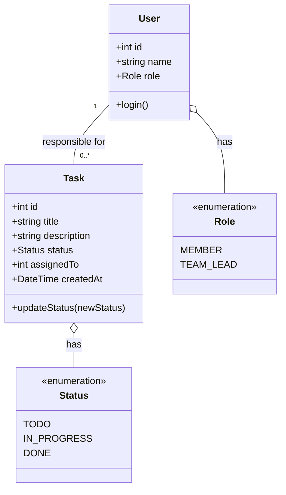
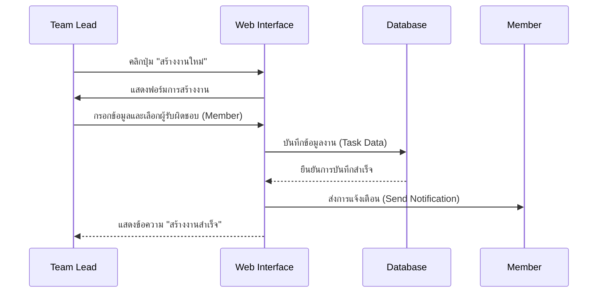

# การจำลองโมเดลระบบ: แผนภาพ UML (UML Diagrams)

ในส่วนนี้ประกอบด้วยแผนภาพ UML ที่ออกแบบมาเพื่อจำลองพฤติกรรมและโครงสร้างของ "ระบบจัดการงาน (Task Management System)" ที่ได้วิเคราะห์ความต้องการไว้ในสัปดาห์ที่ 3

## 1. Use Case Diagram
แผนภาพที่แสดงการโต้ตอบระหว่างผู้ใช้งาน (Actors) และฟังก์ชันต่างๆ ของระบบ

```mermaid
useCaseDiagram
    actor "Member (สมาชิก)" as M
    actor "Team Lead (หัวหน้าทีม)" as TL

    package "Task Management System" {
        usecase "Create Task (สร้างงาน)" as UC1
        usecase "Change Status (เปลี่ยนสถานะ)" as UC2
        usecase "Assign Task (มอบหมายงาน)" as UC3
        usecase "View Team Overview (ดูภาพรวมทีม)" as UC4
    }

    M --> UC1
    M --> UC2
    TL --> UC1
    TL --> UC2
    TL --> UC3
    TL --> UC4
```

## 2. Class Diagram
แผนภาพที่แสดงโครงสร้างและข้อมูลของระบบ



## 3. Sequence Diagram
แผนภาพที่แสดงลำดับขั้นตอนการทำงาน (ตัวอย่าง: การสร้างและมอบหมายงาน)



---
*แบบจำลองโดยใช้ Mermaid.js สัปดาห์ที่ 4*
