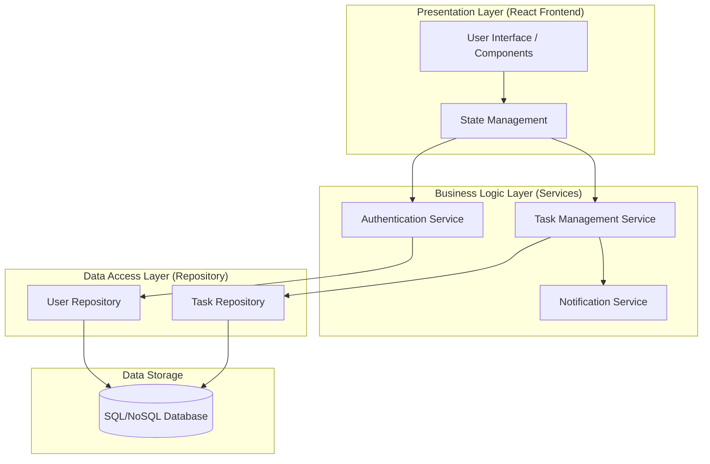

# สถาปัตยกรรมของระบบจัดการงาน (Task Management System Architecture)

การออกแบบในระดับสูง (High Level Design) นี้มุ่งเน้นการแยกส่วนความรับผิดชอบเพื่อให้ระบบมีความยืดหยุ่นและรองรับการพัฒนาต่อด้วยเฟรมเวิร์กสมัยใหม่

## 1. ผังโครงสร้างแบบแยกชั้น (Layered Architecture)

## 2. หน้าที่ของแต่ละส่วน (Component Responsibilities)

| Layer | Responsibility | Example Activity |
| --- | --- | --- |
| **Presentation** | จัดการการแสดงผลและรับข้อมูลจากผู้ใช้ | แสดงผลสรุปงานในรูปแบบ Kanban Board |
| **Business Logic** | ตรวจสอบกฎเกณฑ์ทางธุรกิจ (Business Rules) | ตรวจสอบว่าผู้ที่แก้ไขสถานะงานคือผู้ได้รับมอบหมายหรือไม่ |
| **Data Access** | สั่งการบันทึกหรือดึงข้อมูลจากแหล่งเก็บข้อมูล | ดึงรายชื่อ Task ทั้งหมดจาก Database ตาม User ID |

## 3. รูปแบบการสื่อสาร (Communication Pattern)
ระบบจะใช้รูปแบบ **Client-Server Architecture** โดยที่ Frontend จะสื่อสารกับ Backend ผ่าน **RESTful API** หรือ **GraphQL** เพื่อความคล่องตัวในการเปลี่ยนแปลงเทคโนโลยีในอนาคต

---
*แบบจำลองสถาปัตยกรรมระบบ สัปดาห์ที่ 5*
