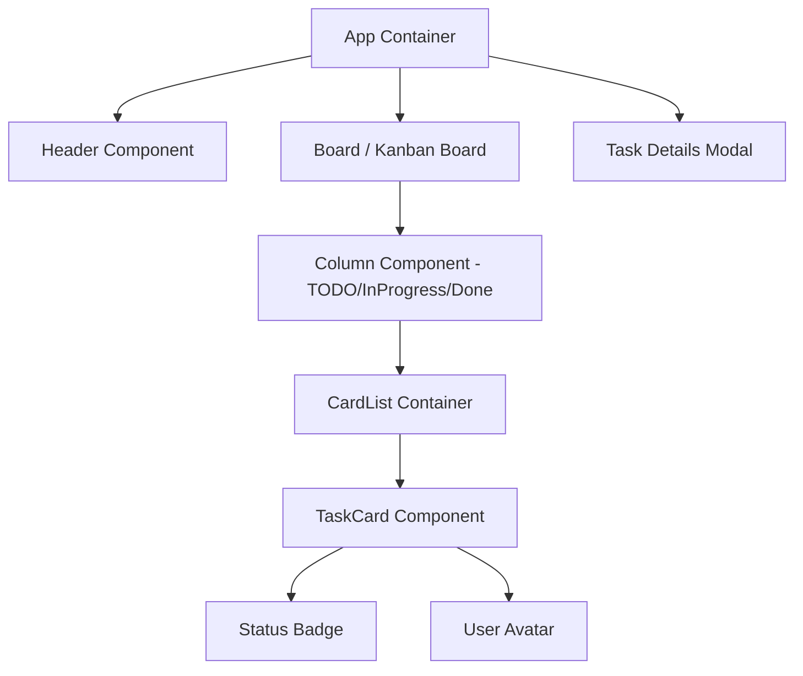

# การออกแบบระดับรายละเอียด (Low Level Design)

เอกสารนี้ระบุรายละเอียดโครงสร้างของส่วนประกอบ (Components) และการไหลของข้อมูล (Data Flow) สำหรับระบบจัดการงานที่พัฒนาด้วย React.js

## 1. ลำดับขั้นของส่วนประกอบ (Component Hierarchy)

## 2. การกำหนด Props และ State (Props & State Definition)

| Component | Responsibility | Props | State |
| --- | --- | --- | --- |
| **App** | จุดรวมข้อมูลหลัก | - | `tasks` (รายการงานทั้งหมด) |
| **Column** | แบ่งกลุ่มงานตามสถานะ | `title`, `status` | - |
| **TaskCard** | แสดงรายละเอียดงานแต่ละงาน | `taskData`, `onStatusChange` | `isHovered` |
| **Badge** | แสดงสีตามสถานะ | `type` (Todo, Done) | - |

## 3. การไหลของข้อมูล (Data Flow)
ระบบใช้หลักการ **Unidirectional Data Flow** (การไหลของข้อมูลทางเดียว):
1.  ข้อมูลรายการงาน (Tasks) ถูกเก็บไว้ใน `State` ของ `App`
2.  ข้อมูลถูกส่งลงไปยัง `Board` -> `Column` -> `TaskCard` ผ่านทาง `Props`
3.  เมื่อมีการเปลี่ยนแปลง (เช่น คลิกปุ่มเปลี่ยนสถานะ) `TaskCard` จะเรียกใช้ฟังก์ชันที่ส่งมาจาก `App` เพื่ออัปเดต `State` ในจุดเดียว (Single Source of Truth)

---
*ผังการออกแบบ LLD สัปดาห์ที่ 6*
